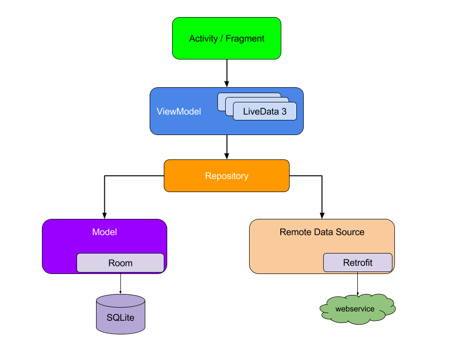

# architecture

基于MVVM架构，基础架构组件封装，基类、ViewModel、ViewBinding封装、主线通信、工具类、网络请求，简单易用。

设计思想：https://www.jianshu.com/p/66be775d54bf
组件化设计：https://www.jianshu.com/p/778606485313

### 1、主要模块

* lib\_arch

    组件初始化：面向接口编程 + meta-data + 反射：

    ViewBinding基类封装：使用反射

    主线通信：注解

    Base相关基类

    ViewModel扩展工具类

* lib\_network
    rxjava+rxandroid+okhttp
    source 包下为示例代码
* lib\_utils
    常用工具类


*   lib\_widget
    通用组件暂无

### 2、 集成

1. arch
   在项目根build.gradle/或者settings.gradle文件中添加
```
allprojects {
		repositories {
			...
			maven { url 'https://www.jitpack.io' }
		}
	}
```
添加dependency
```
dependencies {
	        implementation 'com.ebrightmoon.android:arch:1.0.8'
	}
```
2. network
```
dependencies {
	        implementation 'com.ebrightmoon.android:network:1.0.8'
	}
```
3. utils
```
dependencies {
	        implementation 'com.ebrightmoon.android:utils:1.0.8'
	}
```
4. widget
   暂无

### 使用
可以按照如下视图模型组织代码


### 3、引用

[组件化](https://github.com/Quyunshuo/AndroidBaseFrameMVVM)
[ViewBinding封装](https://blog.csdn.net/qq_20451879/article/details/121148935)
...


### issue

有问题，欢迎反馈
